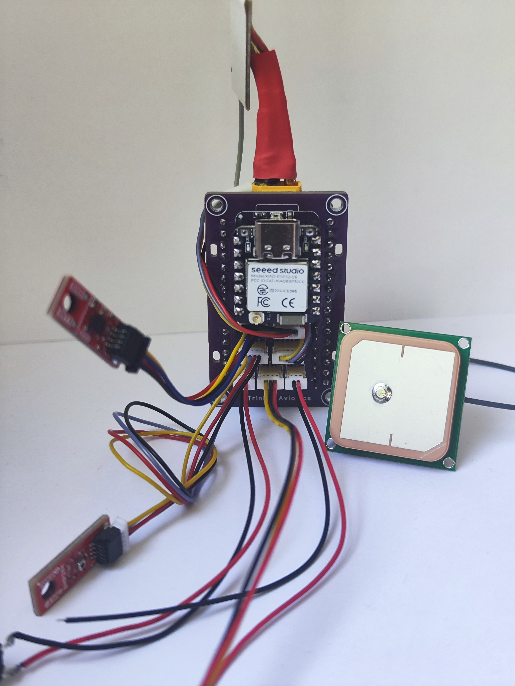
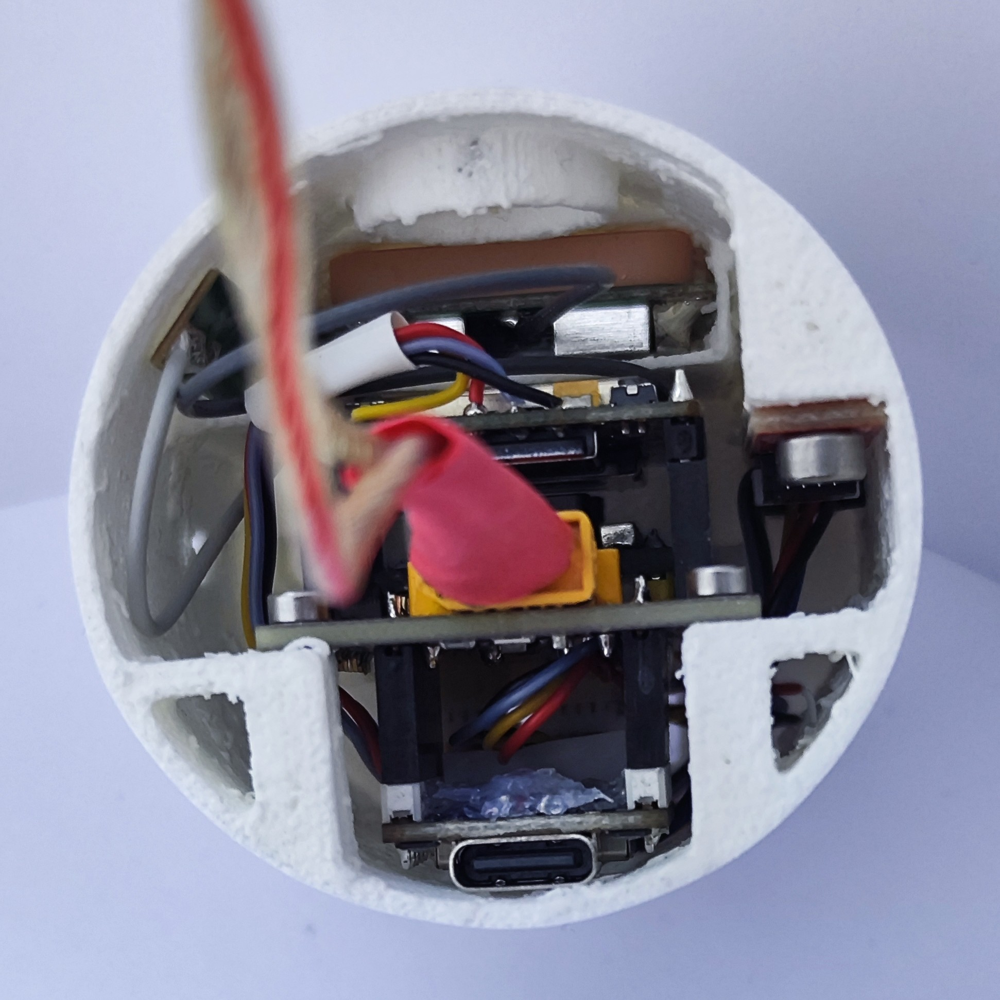

# Trinity Avionics Flight Computer

This repository contains the design and implementation of the avionics flight computer used in our high school rocket, _Trinity_, which competed in the 2025 Czech Rocket Challenge. It includes hardware schematics, firmware, test reports, a telemetry dashboard, and more.

The Trinity avionics system is a modular hub for sensor data acquisition, telemetry, and flight control. It connects a set of QWIIC-compatible sensors via I2C, handles dual serial communication with the A9G GSM+GPS module, and logs data both locally (SD card) and remotely (MQTT via GPRS).

## Highlights and Design Techniques

- **GPIO Extension via Underside Soldering**: To overcome the limited GPIO availability on the [Seeeduino XIAO ESP32-C6](https://wiki.seeedstudio.com/XIAO_ESP32C6_Getting_Started/), we soldered thin wires from the bottom of the board directly to unused pins, routing them to QWIIC connectors.

- **Dual Serial Communication**: The [A9G module](docs/a9g_product_specification.pdf) communicates via [AT commands](docs/a9g_gprs_series_module_at_instruction_set_v1_0-3.pdf) over one UART, while its onboard GPS module ([GK9501](docs/a9g_module_gps.pdf)) uses a second UART, requiring careful pin management and isolation in firmware.

- **SPI Breakout for SD Card**: Since the AT command set cannot access SD cards, we soldered wires to the available breakout pads on the [Pudding Dev Board](https://ai-thinker-open.github.io/GPRS_C_SDK_DOC/en/hardware/pudding-dev-board.html) and routed them directly to an SD card reader (SCK, MOSI, MISO, CS).

- **QWIIC Sensor Network**: Using [QWIIC](https://www.sparkfun.com/qwiic), we connected multiple sensors like:

  - [SparkFun SEN-19833](https://www.sparkfun.com/products/19833) for barometric altitude
  - [SparkFun SEN-21336](https://www.sparkfun.com/products/21336) for 6DoF IMU data

- **Modular Board Mounting**: Both the Seeeduino and Pudding modules are inserted into female headers (not soldered) for easy removal and maintenance. Hot glue ensures mechanical stability without sacrificing access, such as to the SIM card slot.

- **Power Management**: Two independent [MP2315](docs/mp2315.pdf) 5V step-down regulators are used:

  - One for the ESP32 and sensors
  - One for the A9G module, which requires power surge handling due to GPRS spikes ([reference](https://github.com/Ai-Thinker-Open/GPRS_C_SDK/issues/421))

- **Battery Connector**: XT30 was chosen for its polarity protection and durability.

- **Minimal Protection Philosophy**: No battery protection circuitry is used, as continued telemetry (even during battery failure) is more valuable than battery preservation during flight.

- **Battery**: Dualsky Eco 520mAh 2S 30C Li-Pol — chosen for high capacity-to-weight ratio.

- **Integrated Features**:
  - Buzzer for recovery aid
  - Push button for user interaction or reset
  - RGB LED for system state indication

## Technologies & Libraries

- [EasyEDA](https://easyeda.com/) for schematic and PCB design
- [JLCPCB](https://jlcpcb.com/) for manufacturing
- [Dash](https://dash.plotly.com/) + [Plotly](https://plotly.com/python/) for dashboard GUI
- [MQTT](https://mqtt.org/) for wireless telemetry
- [Mapy.com API](https://developer.mapy.com/) for GPS map visualization

## Dashboard Features

Our telemetry dashboard was created using Dash in Python. Key features include:

- Real-time telemetry graphs and system state
- Live GPS location plotting using the Mapy.com API
- Map styles: aerial, tourist, and basic
- Stream mode: when enabled, the dashboard listens for updates to a subscribed CSV file and updates visuals live
- QR code generator for transferring location data from PC to mobile for field recovery

## Battery Capacity Testing

We conducted detailed capacity testing of the flight battery to verify its performance under realistic load conditions. The testing process and results are documented in [`power_analysis.md`](reports/power-analysis/power_analysis.md). These tests help ensure that our power system can handle peak loads, especially during data transmission events via GPRS.

## 3D Printed Case

All avionics components are enclosed in a custom 3D-printed case made from LW-PLA to reduce weight. The main enclosure securely houses the buzzer, GPS antenna, GPRS antenna, user button, two QWIIC sensors, and the mainboard. The battery is inserted from the top, allowing for quick replacement or inspection. The lightweight and modular design makes it easy to access and service individual components while keeping the system compact and flight-ready.

  
  

