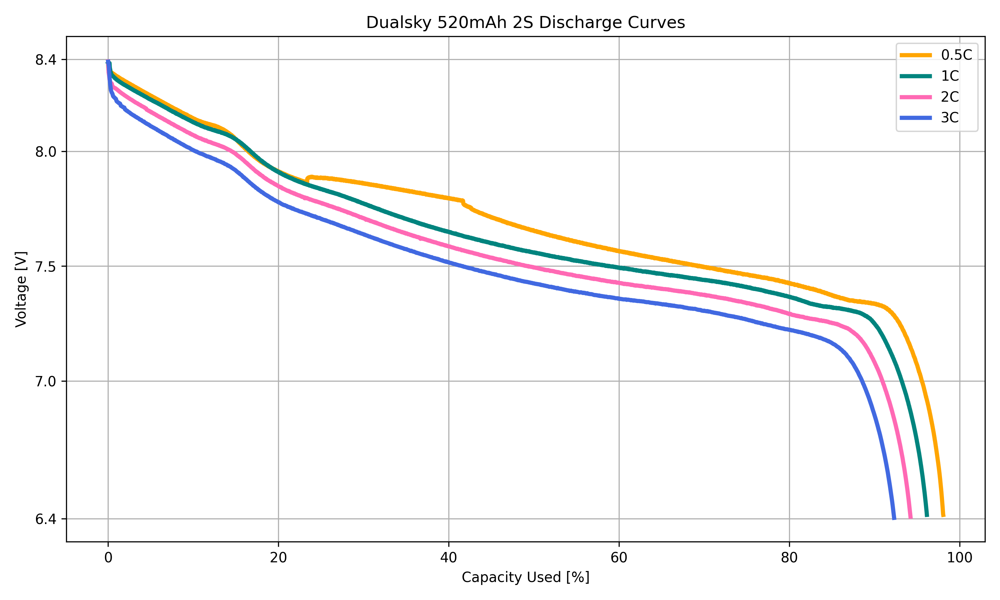

# Power Analysis of Dualsky 520mAh 2S Li-Pol Battery

## Measurement Setup

- **Voltage Measurement:**
  - Instrument: Multimeter UNI-T UT181A (with data logging feature)
- **Load:**
  - Laboratory Electronic Load (200V, 20A, 150W)
- **Battery Under Test:**
  - Type: Li-Pol Dualsky 520mAh 25C 2S 7.4V

## Discharge Rates Tested

- 1C
- 2C
- 3C

## Discharge Curves

Each discharge was performed using the laboratory electronic load, and the voltage was logged throughout the test using the UNI-T UT181A multimeter. The results provide insight into the battery's performance at different discharge rates.
